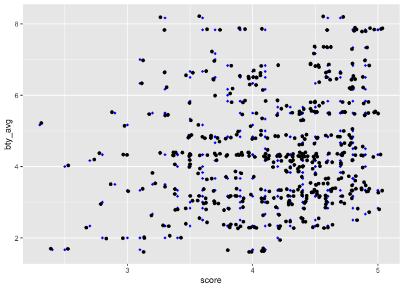

Lab 09 - Grading the professor, Pt. 1
================
Steph Bossert
5 april 2021

### Load packages and data

``` r
library(tidyverse) 
library(tidymodels)
library(openintro)
library(ggplot2)
?evals
view(evals)
```

### Exercise 1

Positively skewed, mean = 4.18, max = 5, Students tend to give positive
evaluations for their professors as the data is positively skewed.

``` r
evals2 <- ggplot(evals, aes(x = score))
evals2 + geom_histogram(bins = 30, color = "white", fill = "blue") +
  geom_vline(aes(xintercept = mean(score)), 
             linetype = "dashed", size = 0.6)
```

<!-- -->

``` r
summary(evals$score)
```

    ##    Min. 1st Qu.  Median    Mean 3rd Qu.    Max. 
    ##   2.300   3.800   4.300   4.175   4.600   5.000

### Exercise 2

There is a direct, positive relationship between a professor’s beuty
score and their evalution score… interesting.

``` r
ggplot(evals, aes(x=score, y=bty_avg)) + 
  geom_point(shape=18, color="blue")+
  geom_smooth(method=lm, se=FALSE, linetype="solid",
             color="red")
```

    ## `geom_smooth()` using formula 'y ~ x'

<!-- -->
\#\#\#Exercise 3 Jitter handles the overplotting of data, adds random
variation

``` r
ggplot(evals, aes(x=score, y=bty_avg)) + 
  geom_point(shape=18, color="blue")+
  geom_jitter()
```

<!-- -->

``` r
ggplot(evals, aes(x=score, y=bty_avg)) + 
  geom_point(shape=18, color="blue")+
  geom_jitter(aes(colour = gender))
```

<!-- --> \#\#\# Exercise 4
score = 3.88 + .07(bty\_avg)

``` r
m_bty = lm(score~bty_avg, data = evals) #Create the linear regression
summary(m_bty)
```

    ## 
    ## Call:
    ## lm(formula = score ~ bty_avg, data = evals)
    ## 
    ## Residuals:
    ##     Min      1Q  Median      3Q     Max 
    ## -1.9246 -0.3690  0.1420  0.3977  0.9309 
    ## 
    ## Coefficients:
    ##             Estimate Std. Error t value Pr(>|t|)    
    ## (Intercept)  3.88034    0.07614   50.96  < 2e-16 ***
    ## bty_avg      0.06664    0.01629    4.09 5.08e-05 ***
    ## ---
    ## Signif. codes:  0 '***' 0.001 '**' 0.01 '*' 0.05 '.' 0.1 ' ' 1
    ## 
    ## Residual standard error: 0.5348 on 461 degrees of freedom
    ## Multiple R-squared:  0.03502,    Adjusted R-squared:  0.03293 
    ## F-statistic: 16.73 on 1 and 461 DF,  p-value: 5.083e-05

``` r
ggplot(evals, aes(x=score, y=bty_avg)) + 
  geom_point(shape=18, color="blue")+
  geom_smooth(method=lm, se=FALSE, linetype="solid",
             color="orange") +
  geom_jitter(aes(colour = gender))
```

    ## `geom_smooth()` using formula 'y ~ x'

<!-- --> \#\#\#Exercise 5

``` r
m_bty = lm(score~bty_avg, data = evals)
ggplot(evals, aes(x=score, y=bty_avg)) + 
  geom_point(shape=18, color="blue")+
  geom_smooth(method=lm, se=FALSE, linetype="solid",
             color="yellow") +
  geom_jitter() 
```

    ## `geom_smooth()` using formula 'y ~ x'

<!-- -->
\#\#\#Exercise 6 Slope = .07, small but direction associated between
average beauty score and score

\#\#\#Exercise 7 It’s positive and fairly large, which makes sense given
the positive skew of the distribution of scores

\#\#\#Exercise 8 R squared = 0.04, so beauty rating accounts for 4% of
the variance in average professor evaluation score.

\#\#\#Exercise 9/10

``` r
m_gen = lm(score~gender, data = evals) #Create the linear regression
summary(m_gen)
```

    ## 
    ## Call:
    ## lm(formula = score ~ gender, data = evals)
    ## 
    ## Residuals:
    ##      Min       1Q   Median       3Q      Max 
    ## -1.83433 -0.36357  0.06567  0.40718  0.90718 
    ## 
    ## Coefficients:
    ##             Estimate Std. Error t value Pr(>|t|)    
    ## (Intercept)  4.09282    0.03867 105.852  < 2e-16 ***
    ## gendermale   0.14151    0.05082   2.784  0.00558 ** 
    ## ---
    ## Signif. codes:  0 '***' 0.001 '**' 0.01 '*' 0.05 '.' 0.1 ' ' 1
    ## 
    ## Residual standard error: 0.5399 on 461 degrees of freedom
    ## Multiple R-squared:  0.01654,    Adjusted R-squared:  0.01441 
    ## F-statistic: 7.753 on 1 and 461 DF,  p-value: 0.005583

``` r
###y= .14(x) + 4.09
###males: .14(0) + 4/09
###females: y= .141(1) + 4.09
```

\#\#\#Exercise 11

``` r
m_rank = lm(score~rank, data = evals) #Create the linear regression
summary(m_rank)
```

    ## 
    ## Call:
    ## lm(formula = score ~ rank, data = evals)
    ## 
    ## Residuals:
    ##     Min      1Q  Median      3Q     Max 
    ## -1.8546 -0.3391  0.1157  0.4305  0.8609 
    ## 
    ## Coefficients:
    ##                  Estimate Std. Error t value Pr(>|t|)    
    ## (Intercept)       4.28431    0.05365  79.853   <2e-16 ***
    ## ranktenure track -0.12968    0.07482  -1.733   0.0837 .  
    ## ranktenured      -0.14518    0.06355  -2.284   0.0228 *  
    ## ---
    ## Signif. codes:  0 '***' 0.001 '**' 0.01 '*' 0.05 '.' 0.1 ' ' 1
    ## 
    ## Residual standard error: 0.5419 on 460 degrees of freedom
    ## Multiple R-squared:  0.01163,    Adjusted R-squared:  0.007332 
    ## F-statistic: 2.706 on 2 and 460 DF,  p-value: 0.06786

``` r
###y= 4.28 -.13(X1) + -.15(X2)
###interpret: zero on both scores means a score of 4.28, controlling for rank tenure track, a decrease in -.14 for the rank tenure position 
```

\#\#\#\#Exercise 12 & 13

``` r
rank_evals <- evals%>%
  mutate(rank_relevel = case_when(rank== "tenure track" ~ 0,
                          rank== "teaching" ~ 1,
                          rank== "tenured" ~ 2))
m_rank_relevel<- lm( score~ rank_relevel, data = rank_evals) #Create the linear regression
summary(m_rank_relevel)
```

    ## 
    ## Call:
    ## lm(formula = score ~ rank_relevel, data = rank_evals)
    ## 
    ## Residuals:
    ##     Min      1Q  Median      3Q     Max 
    ## -1.9032 -0.3599  0.1185  0.4185  0.8401 
    ## 
    ## Coefficients:
    ##              Estimate Std. Error t value Pr(>|t|)    
    ## (Intercept)   4.20317    0.04751  88.463   <2e-16 ***
    ## rank_relevel -0.02166    0.03063  -0.707     0.48    
    ## ---
    ## Signif. codes:  0 '***' 0.001 '**' 0.01 '*' 0.05 '.' 0.1 ' ' 1
    ## 
    ## Residual standard error: 0.5442 on 461 degrees of freedom
    ## Multiple R-squared:  0.001084,   Adjusted R-squared:  -0.001083 
    ## F-statistic:   0.5 on 1 and 461 DF,  p-value: 0.4798

\#\#\#13 Model: Y = 4.20 - .02(X) A teacher who is on the tenure track
has a rank of 4.20, then a teacher who is “teaching” decreases by -.02
and then a teacher who is tenured decreases by -.04 R square = .001

\#\#\#Exercise 14

``` r
tenure_eligible_evals<- evals%>% 
  mutate(Tenure_eligible = if_else(rank == "teaching", "No", "Yes"))
```

\#\#\#Exercise 15

``` r
m_tenure_eligible= lm( score~ Tenure_eligible, data = tenure_eligible_evals) #Create the linear regression
summary(m_tenure_eligible)
```

    ## 
    ## Call:
    ## lm(formula = score ~ Tenure_eligible, data = tenure_eligible_evals)
    ## 
    ## Residuals:
    ##     Min      1Q  Median      3Q     Max 
    ## -1.8438 -0.3438  0.1157  0.4360  0.8562 
    ## 
    ## Coefficients:
    ##                    Estimate Std. Error t value Pr(>|t|)    
    ## (Intercept)          4.2843     0.0536  79.934   <2e-16 ***
    ## Tenure_eligibleYes  -0.1406     0.0607  -2.315    0.021 *  
    ## ---
    ## Signif. codes:  0 '***' 0.001 '**' 0.01 '*' 0.05 '.' 0.1 ' ' 1
    ## 
    ## Residual standard error: 0.5413 on 461 degrees of freedom
    ## Multiple R-squared:  0.0115, Adjusted R-squared:  0.009352 
    ## F-statistic: 5.361 on 1 and 461 DF,  p-value: 0.02103

### Y = 4.28 -1.4(X)

\#\#\#for teachers who are not tenure eligible: Y= 4.28 -(1.4)(0) ,
their score = 4.28, for those that are- Y= 4.28 -(1.4)(1) \#\#\#R square
= .0015
